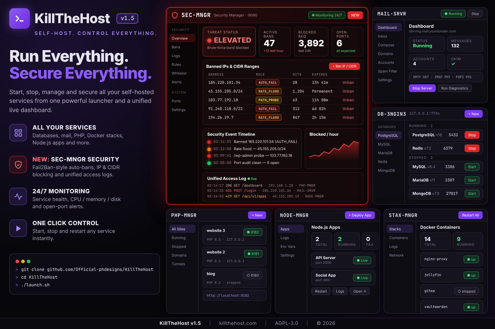
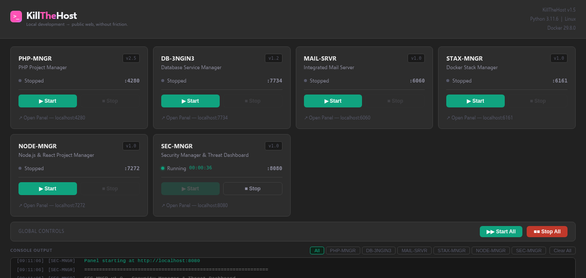
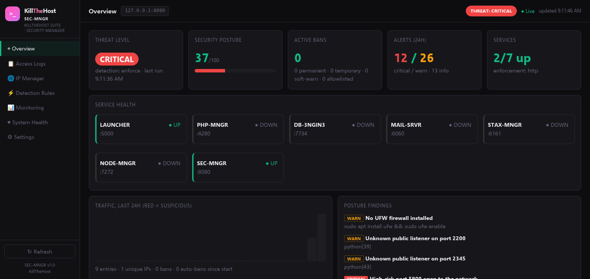
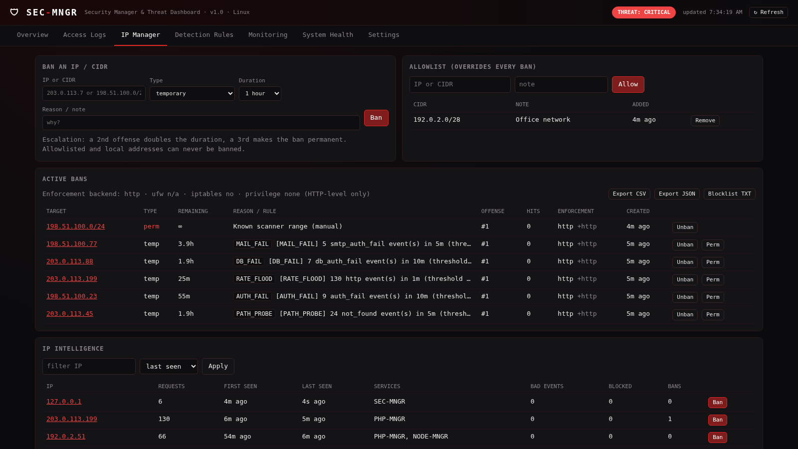

<h1 align="center">KillTheHost v1.5</h1>
<p align="center">
  
</p>
<br/>
<p align="center">
  
</p>
<div align="center">
<br/>

### **Local development → public web, without friction.**

<br/>

[](LICENSE)
[](https://python.org)
[](https://php.net)
[](https://cloudflare.com)
[](https://namecheap.com)
[](https://docs.docker.com/engine/install/)
[](https://nodejs.org)

<br/>

> **KillTheHost** brings together **PHP-MNGR**, **DB-3NGIN3**, **MAIL-SRVR**, **STAX-MNGR**, **NODE-MNGR**, and **SEC-MNGR** into one unified workflow —  
> run your stack locally, manage your databases, host your own email, deploy Docker stacks, manage Node.js apps, lock it all down with 24/7 security monitoring, sync real domains, and go live in a click.

<br/>

[**🌐 Website**](https://killthehost.com)

<br/>

---

</div>

<br/>

## 🆕 What's New in v1.5 — SEC-MNGR

> **KillTheHost v1.5 introduces SEC-MNGR**, a security manager and threat dashboard for the whole stack. It watches every KillTheHost manager, bans attacking IPs automatically, and monitors the host around the clock.

Once your sites, databases and mail server are public, they get probed, scanned and brute-forced. SEC-MNGR collects the logs from every KillTheHost service in one place, detects attack patterns the way Fail2Ban does, and blocks offending IPs or entire CIDR ranges at the firewall.

### 🛡️ SEC-MNGR Highlights

| Feature | Details |
|---|---|
| **Unified access log** | Access and auth logs from PHP-MNGR, DB-3NGIN3, MAIL-SRVR, STAX-MNGR, NODE-MNGR, the launcher and Docker, merged into one searchable log with CSV/JSON export |
| **IP intelligence** | Per-IP history: request count, first/last seen, services hit, blocked attempts |
| **IP & CIDR bans** | Exact IPs or IPv4/IPv6 CIDR ranges; temporary, permanent or soft-warn bans, with notes |
| **Allowlist** | Trusted IPs and ranges override every ban rule |
| **Fail2Ban-style detection** | Built-in rules (AUTH_FAIL, RATE_FLOOD, PATH_PROBE, MALFORMED, MAIL_FAIL, DB_FAIL, REPEAT_OFFENDER) run every 30s; thresholds can be edited in the UI |
| **Escalating penalties** | A 2nd offense doubles the ban length; a 3rd offense makes it permanent |
| **Firewall enforcement** | Uses UFW, then iptables/ip6tables (plus `DOCKER-USER`), then HTTP-level blocking as a fallback |
| **24/7 monitoring** | Every 60s: service health, CPU/memory/disk, Docker, UFW status, and alerts for new listening ports |
| **Security timeline** | INFO / WARN / HIGH / CRITICAL events, each saying exactly which rule fired |
| **Local-only by default** | Binds to `127.0.0.1:8080`, has CSRF and DNS-rebinding protection, and keeps its data at `0700`/`0600` permissions |

```
  PHP-MNGR · DB-3NGIN3 · MAIL-SRVR · STAX-MNGR · NODE-MNGR · Launcher · Docker
        │  logs
        ▼
  SEC-MNGR (127.0.0.1:8080)  ──►  detection rules  ──►  UFW / iptables / HTTP block
        │
        └──►  24/7 health + port monitoring  ──►  security timeline & alerts
```

> 👉 **[Full SEC-MNGR Reference ↓](#️-sec-mngr-reference)**

<br/>

---

## 🟢 Introduced in v1.4 — NODE-MNGR

> **KillTheHost v1.4 introduced NODE-MNGR** — a full browser-based Node.js app manager that brings the same zero-friction deployment experience to React, Next.js, Vite, and Node.js projects.

No more juggling terminal windows, manually running `npm start`, or tracking which port your app is on. NODE-MNGR gives every Node.js project its own dashboard card with live status, controls, logs, and one-click public access via Cloudflare Tunnels.

### 🟢 NODE-MNGR Highlights

| Feature | Details |
|---|---|
| **App Dashboard** | Live status cards for every deployed app — total, running, stopped, and error counts at a glance |
| **Deploy in seconds** | Point NODE-MNGR at a local folder or GitHub repo and hit **+ Deploy App** |
| **Start / Stop / Restart** | Per-app controls directly from the browser — no terminal required |
| **Per-app Node version** | Switch Node.js versions per project via `nvm` — Node 18, 20, 22, and more |
| **Package manager support** | Works with both `npm` and `yarn` |
| **Real-time logs** | Live log streaming per app from the **Logs** tab |
| **Port management** | Auto-assigns ports (3100+) per app, visible on each card |
| **System info** | **System** tab shows host resource usage and nvm environment details |
| **Cloudflare Tunnels** | Expose any Node.js app to the public web with one click — same as PHP-MNGR |

```
  localhost:7272  ──►  NODE-MNGR UI
  localhost:3100  ──►  Your React / Next.js / Vite / Node app
  localhost:3101  ──►  Another app
        ↓
  Cloudflare Tunnel  ──►  yourapp.com
```

### Supported Frameworks

`React` · `Next.js` · `Vite` · `Express` · `Node.js (plain)` · any `npm`/`yarn` project

### Data Locations

| What | Where |
|---|---|
| App registry | `~/.nodemngr/apps.json` |
| App data & builds | `~/.nodemngr/apps/<id>/` |

<br/>

---

## 🧩 What's Inside

KillTheHost is a bundle of six open-source, single-file Python tools unified by a cross-platform browser-based launcher — designed to eliminate the gap between local development and live deployment.

| Tool | Version | Purpose |
|---|---|---|
| ⚡ **Launcher** | `v1.5` | Unified browser UI to start, stop, and monitor all tools — zero dependencies |
| 🐘 **PHP-MNGR** | `v2.5` | Local & Public PHP project manager — spin up, manage, and publish PHP sites via Docker |
| 🗄️ **DB-3NGIN3** | `v1.2` | Local database service manager — PostgreSQL, MySQL, MariaDB, Redis, MongoDB |
| ✉️ **MAIL-SRVR** | `v1.0` | Self-hosted email server — send, receive, IMAP, DKIM, SPF, DMARC, and a full browser mail client |
| 🐳 **STAX-MNGR** | `v1.0` | Docker stack manager — deploy and manage pre-configured application stacks with one click |
| 🟢 **NODE-MNGR** | `v1.0` | Node.js app manager — deploy and manage React, Next.js, Vite, and Node.js projects |
| 🛡️ **SEC-MNGR** | `v1.0` | Security manager — unified access logs, IP bans/allowlist, Fail2Ban-style detection, 24/7 host monitoring (port 8080) *(New in v1.5)* |

Together, they connect to your **Namecheap** domains and route traffic through **Cloudflare Tunnels** — putting your localhost on the public internet without a single line of server config.

<br/>

---

## ✨ Features

<br/>

```
  localhost:5000  ──►  Launcher UI  (control panel for all tools)
  localhost:4280  ──►  PHP-MNGR    ──►  Cloudflare Tunnel  ──►  yoursite.com
  localhost:7734  ──►  DB-3NGIN3   ──►  PostgreSQL · MySQL · Redis · MongoDB
  localhost:6060  ──►  MAIL-SRVR   ──►  SMTP/IMAP  ──►  mail.yourdomain.com
  localhost:6161  ──►  STAX-MNGR   ──►  Docker Stacks  ──►  VaultWarden · Nextcloud · Gitea…
  localhost:7272  ──►  NODE-MNGR   ──►  Node.js Apps  ──►  React · Next.js · Vite…
  localhost:8080  ──►  SEC-MNGR    ──►  Access Logs · IP/CIDR Bans · Fail2Ban Rules  ──►  UFW / iptables
```

<br/>

### ⚡ Unified Launcher
A single browser-based control panel that starts and stops PHP-MNGR, DB-3NGIN3, MAIL-SRVR, STAX-MNGR, NODE-MNGR, and SEC-MNGR with one click. Real-time console output, live status indicators, uptime timers, and port monitoring — all in one place. Launcher events are also written to `~/.killthehost/launcher.log`, so SEC-MNGR can audit them. Zero external dependencies, pure Python standard library.

### 🌐 Domain Sync
Connect your **Namecheap** account and assign real domains to local projects — no manual DNS editing required. More registrar integrations are on the roadmap.

### ☁️ Cloudflare Tunnel Integration
Link a free Cloudflare account and expose local services to the public web securely. No port forwarding. No router config. No tunnel scripts. Works on CGNAT connections (e.g. T-Mobile 5G home internet) where traditional port forwarding is impossible.

### 🚀 One-Click Public Access
From localhost to a live URL in seconds — perfect for client previews, team demos, and real-world testing without a full deployment pipeline.

### 🐘 PHP Project Control
Spin up `php:VERSION-apache` Docker containers per site with a single click. Supports **PHP 7.2 through 8.3**. Each site gets its own port (auto-assigned from 8100+), a browser-based **file manager** (browse, edit, upload, download, rename, delete, chmod), an **inline code editor** for PHP/HTML/CSS/JS, and a **custom `php.ini`** per site.

### 🗄️ Database Service Management
Spin up or shut down **PostgreSQL, MySQL, MariaDB, Redis, and MongoDB** Docker containers with a single click. Live status is polled every 15 seconds, connection strings are always one click away, and persistent data survives container restarts — stored in `~/.db3ngin3/data/`.

### ✉️ Self-Hosted Email Server
Run a complete email server on your own VPS. MAIL-SRVR handles everything: SMTP delivery and inbound receiving, IMAP inbox access, DKIM signing, SPF and DMARC records, and an automated deliverability checklist. Includes a full browser-based email client with compose, rich text editing, file attachments, draft saving, folder navigation (Inbox, Sent, Drafts, Trash, Junk), and per-account HTML signatures.

### 🟢 Node.js App Manager
Deploy and manage React, Next.js, Vite, and Node.js projects from a browser-based dashboard. NODE-MNGR handles app deployment, start/stop/restart controls, per-app Node.js version switching via `nvm`, real-time log streaming, and automatic port assignment — all without touching the terminal. Supports both `npm` and `yarn`. Each app gets its own card with live status, port info, and direct controls. Expose any app to the public web via Cloudflare Tunnels with one click.

> 👉 **[Jump to NODE-MNGR Reference ↓](#-node-mngr-reference)**

### 🛡️ Security Manager — SEC-MNGR *(New in v1.5)*
A single-file, zero-dependency security dashboard on **http://127.0.0.1:8080**. SEC-MNGR collects access and auth logs from every KillTheHost manager into one searchable log. It tracks each IP's history and bans offenders (single IPs or IPv4/IPv6 CIDR ranges) with temporary, permanent or soft-warn bans. A Fail2Ban-style detection engine runs every 30 seconds, and a monitor checks services, CPU/memory/disk, Docker, UFW and listening ports every 60 seconds. Bans are enforced through UFW, then iptables, then HTTP-level blocking as a fallback.

> 👉 **[Jump to SEC-MNGR Reference ↓](#️-sec-mngr-reference)**

<br/>

---

## 📦 Installation

### Requirements

| Requirement | Notes |
|---|---|
| **Python 3.8+** | Standard library only — no pip installs required |
| **Docker** | Used by PHP-MNGR, DB-3NGIN3, MAIL-SRVR, and STAX-MNGR to run all containers |
| **Node.js** | Required for NODE-MNGR — install via [nvm](https://github.com/nvm-sh/nvm) for easy version switching |

**Install Docker on Ubuntu/Linux**

```bash
curl -fsSL https://get.docker.com | sh
sudo usermod -aG docker $USER
# Log out and back in before continuing
```

---

**1. Clone the repo**

```bash
git clone https://github.com/Official-phdesigns/KillTheHost.git
cd KillTheHost
```

**2. Start the Launcher**

**Linux / macOS:**
```bash
chmod +x launch.sh
./launch.sh
```

**Windows:**
```
Double-click launch.bat  — or run it from any terminal
```

The launcher opens automatically at **http://localhost:5000** and lets you start, stop, and monitor all tools from one place.

<br/>

### Folder Structure

```
KillTheHost/
├── launch.sh                   ← Linux / macOS entry point
├── launch.bat                  ← Windows entry point
├── stop.sh / restart.sh        ← Stop / restart the launcher (Linux / macOS)
├── stop.bat / restart.bat      ← Stop / restart the launcher (Windows)
├── LICENSE
├── README.md
└── Launcher/
    ├── launcher.py             ← Browser-based control panel (port 5000)
    └── assets/
        └── main/
            ├── PHP-MNGR v2.5/
            │   └── phpmanager.py
            ├── DB-3NGIN3 v1.2/
            │   └── db3ngin3.py
            ├── MAIL-SRVR v1.0/
            │   └── mailserver.py
            ├── STAX-MNGR v1.0/
            │   └── staxmngr.py
            ├── NODE-MNGR v1.0/
            │   └── nodemngr.py
            └── SEC-MNGR v1.0/          ← New in v1.5
                └── sec_mngr.py         ← Security manager (port 8080)
```

<br/>

---

## 🛠️ Usage

### Using the Launcher

Once `launch.sh` / `launch.bat` is run, a control panel opens in your browser at `http://localhost:5000`.

From there you can:
- **Start / Stop** PHP-MNGR, DB-3NGIN3, MAIL-SRVR, STAX-MNGR, NODE-MNGR, and SEC-MNGR individually or together
- **Open** each panel directly in a new browser tab
- **Monitor** live status, uptime, and real-time console output for all services
- **Filter** console output by service

To stop the launcher itself, press `Ctrl+C` in the terminal. It will gracefully shut down any running services first.

### Stopping & Restarting

If the launcher is running in the background (or in another terminal), use the helper scripts in the project root:

| Platform | Stop | Restart |
|---|---|---|
| Linux / macOS | `./stop.sh` | `./restart.sh` |
| Windows | `stop.bat` | `restart.bat` |

- **stop** finds the launcher via its PID file (`~/.killthehost/launcher.pid`) or whatever is listening on port `5000`, sends a graceful stop (SIGTERM, so managed services shut down cleanly) and force-kills it after 3 seconds if needed.
- **restart** runs the stop script, waits 2 seconds, then starts the launcher again via `launch.sh` / `launch.bat`.

First time on Linux / macOS: `chmod +x stop.sh restart.sh`

> **Gtk module warnings (Linux):** On Debian/Ubuntu, `launch.sh` automatically installs `libcanberra-gtk-module`, `libcanberra-gtk3-module` and `gir1.2-packagekitglib-2.0` if they're missing, which silences the `Failed to load module "canberra-gtk-module"` / `"pk-gtk-module"` warnings when panels open in the browser. If the install can't run (no sudo), the launcher still starts — install them manually with `sudo apt-get install -y libcanberra-gtk-module libcanberra-gtk3-module gir1.2-packagekitglib-2.0`.

### Connecting a Domain
1. Whitelist your public IP address in the Namecheap API settings to allow external requests
2. Create a scoped API token in Cloudflare (avoid using the global API key)
3. Assign the following permissions to the token for the target domain:
   - Account → Cloudflare Tunnel → Edit & Read
   - Zone → Zone → Read
   - Zone → DNS → Edit & Read
4. Open KillTheHost and navigate to **Domains & Tunnels** in PHP-MNGR
5. In **⚙ Settings → Cloudflare**, paste your API token and save
6. In **⚙ Settings → Namecheap**, enter your API key and username
7. Select the desired domain and map it to your local service (port/container)
8. Apply changes — DNS records are provisioned automatically; no manual configuration required

### Going Live with Cloudflare

1. Log in with your **Cloudflare account** (free tier works)
2. Go to **Domains & Tunnels** and click **☁ Tunnel Site** on any domain
3. Select your PHP site from the dropdown
4. Hit **Tunnel Now** — KillTheHost handles the tunnel setup
5. Your site is now reachable at your real domain

### Setting Up Email

1. Open MAIL-SRVR at **http://localhost:6060**
2. Go to **Settings** and switch to **Live mode**
3. Navigate to the **Domain** tab, select your Cloudflare zone, and confirm your public IP
4. Click **▶ Start Server** — MX, A, SPF, and DMARC records are provisioned in Cloudflare automatically
5. After ~60 seconds, click **Provision DKIM** to generate and publish your signing key
6. Add a mailbox in the **Accounts** tab
7. Use the **Compose** tab to send your first email

> **Note:** Live email delivery requires a VPS with a public static IP and outbound port 25 open. MAIL-SRVR includes a deliverability checklist that guides you through every requirement.

### Deploying a Node.js App with NODE-MNGR

1. Open NODE-MNGR at **http://localhost:7272**
2. Click **+ Deploy App** in the top-right corner
3. Point it at your local project folder (or paste a GitHub repo URL)
4. Select your package manager (`npm` or `yarn`) and Node.js version
5. NODE-MNGR installs dependencies and starts your app automatically
6. Your app appears as a card on the dashboard — click **Open** to view it in the browser
7. To go public, click the **Cloudflare Tunnel** button on the app card and assign a domain

> **Tip:** Use the **Node** button on each app card to switch Node.js versions per project without affecting other apps.

### Securing Your Stack with SEC-MNGR

1. Start **SEC-MNGR** from the launcher (or click **Start All**), then open **http://127.0.0.1:8080**
2. Check **Overview**: threat level, security posture score, service health and posture findings (for example, panels exposed on `0.0.0.0`)
3. In **IP Manager**, add your own IP or office range to the **Allowlist** first so you never lock yourself out
4. Review the thresholds in **Detection Rules**. Automatic bans start as soon as a rule fires; set **Settings → detection mode** to `monitor` to only log while you tune them
5. Ban an IP or CIDR range by hand from **IP Manager → Ban an IP / CIDR**
6. For real firewall bans, run the launcher with root or passwordless `sudo` and have UFW or iptables installed. Without them, SEC-MNGR blocks banned IPs itself at the HTTP level and lists the exact firewall commands to run
7. Use **Access Logs** to search traffic across every service and export it to CSV/JSON

> **Tip:** SEC-MNGR has no login. Keep it bound to `127.0.0.1` and reach it remotely through an SSH tunnel: `ssh -L 8080:127.0.0.1:8080 user@your-vps`.

<br/>

---

## 🐘 PHP-MNGR Reference

### Supported PHP Versions

PHP-MNGR runs each site inside a `php:VERSION-apache` Docker container. Supported versions:

`7.2` · `7.3` · `7.4` · `8.0` · `8.1` · `8.2` · `8.3`

### Port Assignments

| Service | Port |
|---|---|
| Launcher UI | 5000 |
| PHP-MNGR UI | 4280 |
| PHP sites (auto-assigned) | 8100, 8101, 8102… |

### Architecture

```
Internet
  └── yourdomain.com (Cloudflare Edge)
        └── Cloudflare Named Tunnel (cloudflared container)
              └── http://localhost:8100
                    └── PHP Docker container (website)

PHP-MNGR UI → http://localhost:4280
Launcher UI → http://localhost:5000
```

### Data Locations

| What | Where |
|---|---|
| Site registry | `~/.phpmngr/sites.json` |
| Tunnel registry | `~/.phpmngr/tunnels.json` |
| Cloudflare credentials | `~/.phpmngr/cloudflare.json` |
| Namecheap credentials | `~/.phpmngr/namecheap.json` |
| Site web roots | `~/.phpmngr/sites/<id>/www/` |
| Per-site PHP config | `~/.phpmngr/sites/<id>/php.ini` |

<br/>

---

## 🗄️ DB-3NGIN3 Reference

### Supported Databases

DB-3NGIN3 manages the following engines via Docker:

| Database | Versions | Default Port | User | Password |
|---|---|---|---|---|
| **PostgreSQL** | 13, 14, 15, 16 | 5432 | `postgres` | `postgres` |
| **MySQL** | 5.7, 8.0, 8.3 | 3306 | `admin` | `admin` |
| **MariaDB** | 10.6, 10.11, 11.3 | 3307 | `root` | `root` |
| **Redis** | 6.2, 7.0, 7.2 | 6379 | — | — |
| **MongoDB** | 5.0, 6.0, 7.0 | 27017 | `admin` | `admin` |

> ⚠️ **Security Notice:** These are default credentials for local development. Do not expose database containers publicly without changing credentials first.

### Data Locations

| What | Where |
|---|---|
| Instance metadata | `~/.db3ngin3/instances.json` |
| Database files | `~/.db3ngin3/data/<instance-id>/` |

Deleting an instance removes the Docker container but **preserves data files on disk**.

<br/>

---

## ✉️ MAIL-SRVR Reference

### Requirements for Live Mode

| Requirement | Notes |
|---|---|
| **VPS** | Static public IP required. Port 25 must be open outbound. |
| **Domain** | Must be managed via Cloudflare DNS (free account works). |
| **Cloudflare token** | Shared with PHP-MNGR — enter once in PHP-MNGR Settings. |
| **Recommended VPS** | Hetzner, Contabo — port 25 open by default. OVH/Vultr require a support ticket. |

### DNS Records (Auto-Provisioned)

| Record | Type | Purpose |
|---|---|---|
| `mail.yourdomain.com` | A (DNS-only) | Mail server address |
| `yourdomain.com` | MX | Incoming mail routing |
| `yourdomain.com` | TXT (SPF) | Sender Policy Framework |
| `_dmarc.yourdomain.com` | TXT (DMARC) | DMARC policy |
| `mail._domainkey.yourdomain.com` | TXT (DKIM) | DKIM signing key |

### Port Assignments

| Service | Port |
|---|---|
| MAIL-SRVR UI | 6060 |
| SMTP submission (outbound) | 587 |
| IMAP (inbox) | 143 |
| Postfix inbound | 25 |
| Mailpit UI (dev mode) | 8025 |

### Data Locations

| What | Where |
|---|---|
| Configuration | `~/.mailsrvr/config.json` |
| Accounts | `~/.mailsrvr/accounts.json` |
| Checklist state | `~/.mailsrvr/checklist.json` |
| Mail storage | `~/.mailsrvr/mail-data/` |
| DKIM keys & Postfix config | `~/.mailsrvr/config/` |

<br/>

---

## 🟢 NODE-MNGR Reference

### Supported Frameworks & Runtimes

`React` · `Next.js` · `Vite` · `Express` · `Node.js (plain)` · any `npm` or `yarn` project

### Port Assignments

| Service | Port |
|---|---|
| NODE-MNGR UI | 7272 |
| Apps (auto-assigned) | 3100, 3101, 3102… |

### Node.js Version Switching

NODE-MNGR uses `nvm` under the hood to manage Node.js versions per app. Each app card shows the active Node version and includes a **Node** button to switch versions without affecting other running apps.

Recommended: install `nvm` before using NODE-MNGR:

```bash
curl -o- https://raw.githubusercontent.com/nvm-sh/nvm/v0.39.7/install.sh | bash
```

### Dashboard Overview

| Panel | What it shows |
|---|---|
| **Apps** | All deployed apps with live status, port, package manager, and controls |
| **Logs** | Real-time log output per app |
| **System** | Host resource usage, nvm environment, and Node.js version info |

### App Card Controls

| Control | Action |
|---|---|
| **Stop** | Gracefully stop the running app process |
| **Restart** | Restart the app (re-runs the start command) |
| **Open** | Open the app in a new browser tab |
| **Node** | Switch the Node.js version for this app via nvm |
| **⚙** | App settings — rename, change start command, delete |

### Data Locations

| What | Where |
|---|---|
| App registry | `~/.nodemngr/apps.json` |
| App data & builds | `~/.nodemngr/apps/<id>/` |

<br/>

---

### 🐳 Docker Stack Manager *(New in v1.3)*
Deploy and manage pre-configured Docker application stacks with a single click. STAX-MNGR ships with 10 ready-to-use stacks — from password managers and media servers to local AI and self-hosted Git. Each stack is a fully configured Docker Compose setup with persistent data volumes.

| Stack | Port | Category |
|---|---|---|
| 🔐 VaultWarden | 8200 | Privacy |
| 📡 Uptime Kuma | 3002 | Monitoring |
| 🎵 Navidrome | 4533 | Media |
| 📖 Wiki.js | 3003 | Productivity |
| 🎬 Jellyfin | 8096 | Media |
| 🤖 Ollama | 11434 | AI |
| 💬 Open WebUI | 3000 | AI |
| 📝 WordPress | 8080 | CMS |
| ☁️ Nextcloud | 8081 | Productivity |
| 🐙 Gitea | 3001 | Development |

<br/>

---

## 🛡️ SEC-MNGR Reference

SEC-MNGR (`Launcher/assets/main/SEC-MNGR v1.0/sec_mngr.py`) is the security layer for the whole KillTheHost stack. It is a single Python 3.8+ file that uses only the standard library, with the dashboard embedded in it. Start it from the launcher, or run it directly:

```bash
python3 "Launcher/assets/main/SEC-MNGR v1.0/sec_mngr.py"                 # http://127.0.0.1:8080
python3 "Launcher/assets/main/SEC-MNGR v1.0/sec_mngr.py" --host 127.0.0.1 --port 8080 --no-browser
# Environment overrides: SECMNGR_HOST, SECMNGR_PORT, SECMNGR_NO_BROWSER=1
```

> By default the panel binds to **127.0.0.1**. It has no login, so do not expose it publicly. If you need remote access, use an SSH tunnel (`ssh -L 8080:127.0.0.1:8080 user@vps`).

### Features

| Area | What it does |
|---|---|
| **Access logging** | Tails the log files in `~/.phpmngr/`, `~/.db3ngin3/`, `~/.mailsrvr/` (including `mail-logs/`), `~/.staxmngr/`, `~/.nodemngr/` and the launcher's `~/.killthehost/launcher.log`. It also reads the Docker logs of manager containers (`phpmngr-*`, `db3ngin3_*`, `killthehost-mail*`, `stax-*`). Each line is normalised to timestamp, IP, method, path, status, user agent, service and event type, then appended to `~/.secmngr/access_logs.jsonl`. |
| **Log parsing** | Common/combined access logs (Nginx/Apache/PHP), Python `http.server` errors, Postfix SASL and Dovecot auth failures, SMTP protocol errors and rejects, MySQL/MariaDB "Access denied", PostgreSQL `pg_hba` and password failures, MongoDB auth failures, and generic "authentication failed" lines. |
| **Search & export** | Filter by service, IP or CIDR, event type, status, free text and date range. Searches the in-memory ring by default, or the full on-disk history. Exports to **CSV** or **JSON**. |
| **Rotation** | Retention defaults to **30 days** and is configurable, with an optional size cap (`max_log_mb`). Rotation runs every 6 hours. |
| **IP intelligence** | Tracks each IP's request count, first and last seen, services touched, event-type breakdown, blocked requests, bans, and last user agent. The detail view shows ban history, alerts and recent log lines. |
| **Bans** | Supports exact IPs and IPv4/IPv6 CIDR ranges (at least /8 for IPv4 and /16 for IPv6). Ban types are **temp**, **perm** and **soft-warn** (logged, not blocked), each with a reason or note. Bans persist in `~/.secmngr/bans.json` and are re-applied on start. |
| **Escalation** | A 2nd offense doubles the ban duration and a 3rd offense makes it permanent. The `REPEAT_OFFENDER` rule also promotes any IP banned *N* times to a permanent ban. |
| **Allowlist** | Overrides everything. Adding an entry lifts any ban it covers, and allowlisted IPs are never auto-banned. Loopback and the host's own addresses are always protected, so you cannot lock yourself out. |
| **Detection engine** | A background thread runs every 30 seconds. Rules are listed below, and every threshold, window, duration and on/off toggle can be edited in the UI. Alerts name the rule that fired, the count, the window and the services involved. In **monitor** mode, detections create soft-warns instead of bans. |
| **Monitoring** | A background thread runs every 60 seconds. It checks service UP/DOWN/WARN for each manager's port (WARN means bound to all interfaces), CPU, memory, disk, the Docker daemon, UFW status and rules, and listening ports via `ss` or `netstat`. It alerts on **new suspicious ports** (unknown public listeners, and high-risk ports such as 23, 2375, 4444, 5900 and 3389). It also warns when a manager's secret file is readable by other users. Events go to `~/.secmngr/events.jsonl` with INFO, WARN or CRITICAL severity, and a snapshot goes to `~/.secmngr/health.json`. |
| **Dashboard** | Dark red and black theme with tabs: **Overview · Access Logs · IP Manager · Detection Rules · Monitoring · System Health · Settings**. Auto-refreshes every 30 seconds. Includes a threat level, a posture score with findings, a 24-hour traffic chart, service health cards, an events timeline, and export buttons for logs and bans (CSV, JSON, TXT blocklist). |

### Detection Rules (defaults)

| Rule | Trigger | Ban |
|---|---|---|
| `AUTH_FAIL` | 5 auth failures (HTTP 401/403, app auth errors) in 10 min | 1 h |
| `RATE_FLOOD` | 100 HTTP requests in 60 s | 30 min |
| `PATH_PROBE` | 10 × 404 in 5 min (scanner enumeration) | 2 h |
| `MALFORMED` | 20 malformed requests (400/408/414/431/505, bad request lines, SMTP protocol abuse) in 10 min | 1 h |
| `MAIL_FAIL` | 3 SMTP/IMAP auth failures in 5 min | 4 h |
| `DB_FAIL` | 5 database auth failures in 10 min | 2 h |
| `REPEAT_OFFENDER` | IP banned 3 times | permanent |

### Enforcement Model

1. **UFW** (`ufw prepend deny from <ip>`) if UFW is installed and active.
2. **iptables / ip6tables** (`-I INPUT 1 … -j DROP`, tagged with a `secmngr` comment) otherwise. When the `DOCKER-USER` chain exists, SEC-MNGR adds a matching rule there too, because Docker-published ports bypass UFW.
3. **HTTP-level** blocking always applies: SEC-MNGR itself returns 403 to banned IPs, and every ban is written to `~/.secmngr/blocklist.txt` for other tools to use.

Firewall commands need root or passwordless `sudo -n`. **Without them, SEC-MNGR does not fail.** It logs the exact commands to run (see *IP Manager → Firewall commands needing sudo* and *Monitoring → Pending commands*) and relies on HTTP-level blocking until they are run.

### REST API

| Method | Endpoint | Description |
|---|---|---|
| GET | `/api/status` | Threat level, posture score and findings, ban counts, alerts, service states |
| GET | `/api/logs?service=&ip=&event_type=&q=&since=&until=&limit=&deep=1` | Search access logs |
| GET | `/api/logs/export?format=csv\|json` | Export logs (same filters) |
| GET | `/api/bans` | Active bans, allowlist, firewall capabilities |
| POST | `/api/bans` | `{"ip": "1.2.3.4" or "cidr", "type": "temp\|perm\|soft", "duration": 3600, "reason": "..."}` |
| DELETE | `/api/bans/{ip}` | Unban (URL-encode CIDRs: `198.51.100.0%2F24`) |
| GET | `/api/bans/export?format=csv\|json\|txt` | Export bans / plain blocklist |
| GET/POST/DELETE | `/api/allowlist[/{cidr}]` | Manage the allowlist |
| GET | `/api/ips`, `/api/ips/{ip}` | IP intelligence list / detail |
| GET | `/api/events?hours=&severity=&category=` | Security event timeline |
| GET | `/api/health` | Latest monitoring snapshot and log sources |
| GET/POST | `/api/rules` | Read or update detection rules (`{"rules":[{"id":"AUTH_FAIL","threshold":5,...}]}`) |
| GET | `/api/stats?hours=24` | Aggregates: hourly traffic, top IPs and offenders, bans by rule |
| GET/POST | `/api/settings` | Retention, intervals, mode, thresholds, known ports |

Every mutating request (POST or DELETE) must send `X-SecMngr-Request: 1`, and every POST must send `Content-Type: application/json`. Cross-origin requests and unknown `Host` headers are rejected, which protects against CSRF and DNS rebinding. Example:

```bash
curl -X POST http://127.0.0.1:8080/api/bans \
  -H 'X-SecMngr-Request: 1' -H 'Content-Type: application/json' \
  -d '{"ip":"203.0.113.9","type":"temp","duration":3600,"reason":"scanner"}'
```

### Security Model

- `~/.secmngr/` is created with mode `0700`, and every file in it is written `0600` (atomic writes).
- SEC-MNGR stores **no secrets**. Other managers' directories and configs are opened **read-only**.
- Shell commands are never built from strings. Firewall calls use argument lists, and IPs are validated with `ipaddress` first.
- Every value shown in the dashboard is HTML-escaped, because log lines contain attacker-controlled data. Responses send a strict CSP and `X-Frame-Options: DENY`.

### Data Locations

| Item | Path |
|---|---|
| Access log (append-only JSONL) | `~/.secmngr/access_logs.jsonl` |
| Security events | `~/.secmngr/events.jsonl` |
| Bans, allowlist, offense counters | `~/.secmngr/bans.json` |
| Detection rules | `~/.secmngr/rules.json` |
| Settings | `~/.secmngr/settings.json` |
| Latest health snapshot | `~/.secmngr/health.json` |
| Per-IP statistics | `~/.secmngr/ip_stats.json` |
| Log tail offsets | `~/.secmngr/tail_state.json` |
| Plain blocklist (one IP/CIDR per line) | `~/.secmngr/blocklist.txt` |
| Launcher log (read by SEC-MNGR) | `~/.killthehost/launcher.log` |

<br/>

---

## 🗺️ Survive Reboots

```bash
# Auto-restart site containers
docker update --restart unless-stopped <site-name>

# Start manually after reboot
./launch.sh        # Linux / macOS
launch.bat         # Windows
```

**Optional: systemd service (Linux)**

```ini
# Save as ~/.config/systemd/user/killthehost.service
[Unit]
Description=KillTheHost Launcher

[Service]
ExecStart=/bin/sh /path/to/KillTheHost/launch.sh
WorkingDirectory=/path/to/KillTheHost
Restart=on-failure

[Install]
WantedBy=default.target
```

```bash
systemctl --user enable --now killthehost
```

<br/>

---

## 🗺️ Roadmap

- [x] PHP site management (PHP-MNGR)
- [x] Database service management (DB-3NGIN3)
- [x] Cloudflare tunnel integration
- [x] Namecheap domain sync
- [x] Unified cross-platform launcher (v1.1)
- [x] Self-hosted email server with full browser client (MAIL-SRVR v1.1)
- [x] Docker stack manager with pre-configured application stacks (STAX-MNGR v1.0)
- [x] Node.js app manager with nvm version switching and Cloudflare tunnel support (NODE-MNGR v1.1)
- [x] Additional domain registrar support (GoDaddy, Porkbun, Cloudflare Registrar…)
- [x] Security manager with unified access logging, IP/CIDR bans, Fail2Ban-style detection and 24/7 monitoring (SEC-MNGR v1.0) ← **New in v1.5**
- [ ] Multi-domain email support in MAIL-SRVR
- [ ] MAIL-SRVR relay/smarthost option for providers that block port 25
- [ ] NODE-MNGR: GitHub auto-deploy / webhook triggers
- [ ] NODE-MNGR: Environment variable manager per app

<br/>

---

## 🖥️ Screenshots

<div align="center">

### ⚡ KillTheHost Launcher — Main Control Panel

[](.github/assets/screenshots/LAUNCHER-v1.5.png)

*Dedicated control panel for managing all six KillTheHost services, now including SEC-MNGR — status, uptime, runtime controls, and a filterable console*

<br/>

### 🛡️ SEC-MNGR — Security Overview *(New in v1.5)*

[](.github/assets/screenshots/SEC-MNGR-overview.png)

*Threat level, security posture score, active bans, 24h alerts, live health of every KillTheHost service, posture findings, and a recent-alerts timeline*

<br/>

### 🛡️ SEC-MNGR — IP Manager & Auto-Bans *(New in v1.5)*

[](.github/assets/screenshots/SEC-MNGR-ip-manager.png)

*Ban single IPs or CIDR ranges, manage the allowlist, and review automatic bans from AUTH_FAIL, RATE_FLOOD, PATH_PROBE, MAIL_FAIL, and DB_FAIL rules — with CSV/JSON/blocklist export*

<br/>

### 🟢 NODE-MNGR — Node.js App Manager

[](https://ibb.co/VYv4h9gh)

*Deploy and manage React, Next.js, Vite, and Node.js apps — live status, per-app Node version switching, real-time logs, and Cloudflare tunnel support*

<br/>

### 🐘 PHP-MNGR — Site Management View

[](https://ibb.co/B2VMWCPk)

*Manage & create every PHP project with runtime info, port visibility, inline editing, and Cloudflare tunneling*

<br/>

### 🗄️ DB-3NGIN3 — Database Instance Control

[](https://ibb.co/hxQvHbtx)

*Spin up and manage PostgreSQL, MySQL, MariaDB, Redis, and MongoDB — live status, connection strings, persistent data*

<br/>

### ✉️ MAIL-SRVR — Browser Email Client

[](https://ibb.co/5WPxbwWZ)

*Full email client — compose with rich text and attachments, inbox with folders, deliverability checklist, DKIM provisioning*

<br/>

### 🐳 STAX-MNGR — Docker Stack Manager

[](https://ibb.co/xKfVK5Lv)

*Deploy pre-configured Docker stacks — VaultWarden, Nextcloud, Gitea, Jellyfin, Ollama, and more — with one click*

</div>

<br/>

---

## 🤝 Contributing

Contributions are welcome and appreciated! Here's how to get involved:

```bash
# Fork the repo, then:
git clone https://github.com/Official-phdesigns/KillTheHost.git
cd killthehost
git checkout -b feature/your-feature-name
```

1. Make your changes
2. Write or update tests if applicable
3. Open a pull request with a clear description

For major changes, please open an issue first to discuss what you'd like to change.

<br/>

---

## 📄 License

This project is licensed under the **GNU Affero General Public License v3.0 (AGPL-3.0)** — see the [LICENSE](LICENSE) file for details.

Any modified versions of this software that are run over a network must also be made available as open source under the same license.

<br/>

---

<div align="center">

**Copyright © 2026 KillTheHost — Developed by PhDesigns, LLC**

[killthehost.com](https://killthehost.com) &nbsp;·&nbsp; [Report a Bug](https://github.com/Official-phdesigns/KillTheHost/issues) &nbsp;·&nbsp; [Request a Feature](https://github.com/Official-phdesigns/KillTheHost/issues)

<br/>

*Stop treating localhost like a dead end.*

</div>
